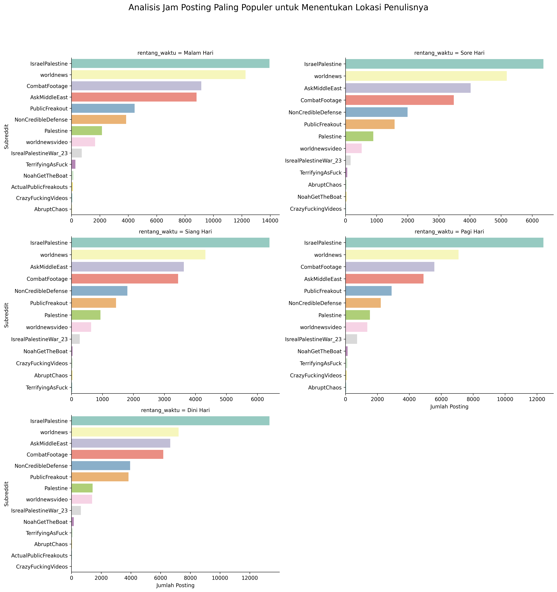
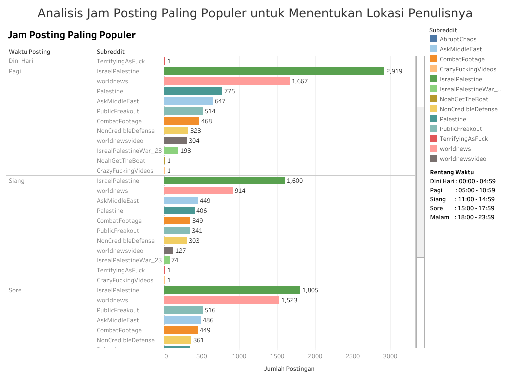

# Links
- [Link to the article](https://blog.azizprabowo.com/data-science/analisis-waktu-posting-paling-populer-di-reddit-terkait-konflik-israel-palestina)
- [Dataset on Kaggle](https://www.kaggle.com/datasets/asaniczka/reddit-on-israel-palestine-daily-updated)
- [Jupyter Notebook on Kaggle](https://www.kaggle.com/code/azizp123/most-pop-posting-hours-to-determine-the-auths-loc)
- [Local Jupyter Notebook File](jam-posting.ipynb)
- [Visualization on Tableau Public](https://public.tableau.com/app/profile/aziz.prabowo3984/viz/AnalisisJamPostingPalingPopuleruntukMenentukanLokasiPenulisnya/Dashboard1)
- [Tableau File](tableau/tableau.twbx)
  
# Visualization using Matplotlib & Seaborn

# Visualization using Tableau

