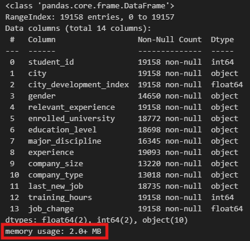
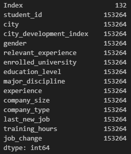
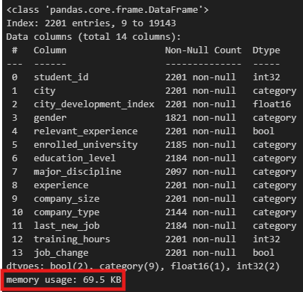
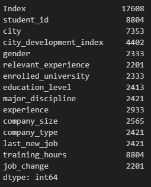

# Project Description
A common problem when creating models to generate business value from data is that the datasets can be so large that it can take days for the model to generate predictions. Ensuring that your dataset is stored as efficiently as possible is crucial for allowing these models to run on a more reasonable timescale without having to reduce the size of the dataset.

You've been hired by a major online data science training provider called *Training Data Ltd.* to clean up one of their largest customer datasets. This dataset will eventually be used to predict whether their students are looking for a new job or not, information that they will then use to direct them to prospective recruiters.

You've been given access to `customer_train.csv`, which is a subset of their entire customer dataset, so you can create a proof-of-concept of a much more efficient storage solution.

> [!NOTE]  
> The project inspiration comes from DataCamp’s [Customer Analytics: Preparing Data for Modeling](https://app.datacamp.com/learn/projects/1600) project, which served as the foundation for this work.
> All code and insights in this project are my own.

# Dataset
### **customer_train.csv**
The dataset contains anonymized student information, and whether they were looking for a new job or not during training:

| Column                   | Description                                                                      |
|------------------------- |--------------------------------------------------------------------------------- |
| `student_id`             | A unique ID for each student.                                                    |
| `city`                   | A code for the city the student lives in.                                        |
| `city_development_index` | A scaled development index for the city.                                         |
| `gender`                 | The student's gender.                                                            |
| `relevant_experience`    | An indicator of the student's work relevant experience.                          |
| `enrolled_university`    | The type of university course enrolled in (if any).                              |
| `education_level`        | The student's education level.                                                   |
| `major_discipline`       | The educational discipline of the student.                                       |
| `experience`             | The student's total work experience (in years).                                  |
| `company_size`           | The number of employees at the student's current employer.                       |
| `company_type`           | The type of company employing the student.                                       |
| `last_new_job`           | The number of years between the student's current and previous jobs.             |
| `training_hours`         | The number of hours of training completed.                                       |
| `job_change`             | An indicator of whether the student is looking for a new job (`1`) or not (`0`). |

# Task
The Head Data Scientist at *Training Data Ltd.* has asked you to create a DataFrame called `ds_jobs_transformed` that stores the data in `customer_train.csv` much more efficiently. Specifically, they have set the following requirements:

- Columns containing categories with only two factors must be stored as Booleans (`bool`).
- Columns containing integers *only* must be stored as 32-bit integers (`int32`).
- Columns containing floats must be stored as 16-bit floats (`float16`).
- Columns containing nominal categorical data must be stored as the `category` data type.
- Columns containing ordinal categorical data must be stored as *ordered categories*, and not mapped to numerical values, with an order that reflects the natural order of the column.
- The DataFrame should be filtered to only contain students with *10 or more years* of experience at companies with *at least 1000 employees*, as their recruiter base is suited to more experienced professionals at enterprise companies.

If you call `.info()` or `.memory_usage()` methods on `ds_jobs` and `ds_jobs_transformed` after you've preprocessed it, you should notice a substantial decrease in memory usage.

# Solution
- [Jupyter Notebook](https://github.com/azizp128/data-science-projects/blob/main/customer-analytics-preparing-data-for-modeling/notebook.ipynb)
- [Microsoft Excel Workbook](https://raw.githubusercontent.com/azizp128/data-science-projects/refs/heads/main/customer-analytics-preparing-data-for-modeling/workbook.xlsx)

# Findings
- Memory usage before data type transformation
    - Column Details

        
    - Memory usage of each column in bytes

        
- Memory usage after data type transformation
    - Column Details

        
    - Memory usage of each column in bytes

        
