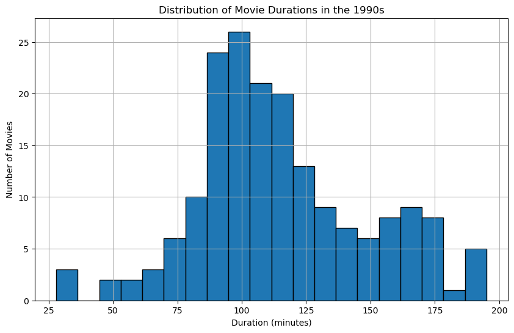

# Project Description
**Netflix**! What started in 1997 as a DVD rental service has since exploded into one of the largest entertainment and media companies.

Given the large number of movies and series available on the platform, it is a perfect opportunity to flex your exploratory data analysis skills and dive into the entertainment industry.

You work for a production company that specializes in nostalgic styles. You want to do some research on movies released in the 1990's. You'll delve into Netflix data and perform exploratory data analysis to better understand this awesome movie decade!

You have been supplied with the dataset `netflix_data.csv`, along with the following table detailing the column names and descriptions. Feel free to experiment further after submitting!

> [!NOTE]  
> The project inspiration comes from DataCamp’s [Investigating Netflix Movies](https://app.datacamp.com/learn/projects/investigating_netflix) project, which served as the foundation for this work.
> All code and insights in this project are my own.

# Dataset
### **netflix_data.csv**
| Column | Description |
|--------|-------------|
| `show_id` | The ID of the show |
| `type` | Type of show |
| `title` | Title of the show |
| `director` | Director of the show |
| `cast` | Cast of the show |
| `country` | Country of origin |
| `date_added` | Date added to Netflix |
| `release_year` | Year of Netflix release |
| `duration` | Duration of the show in minutes |
| `description` | Description of the show |
| `genre` | Show genre |

# Task
- Filter the data for movies released in the 1990s.
- Find the most frequent movie duration.
- Count the number of short action movies from the 1990s.

# Solution
- [Jupyter Notebook](notebook.ipynb)
- [Microsoft Excel Workbook](workbook.xlsx)

# Findings
- Find the most frequent movie duration.
    - The most frequent movie duration for films released in the 1990s was 94 minutes.
    - From the graph below, we can observe that the distribution of movie durations in this decade follows a **normal distribution** with a bell curve shape. The majority of movies tend to have durations ranging from **80** to **120** minutes, with the distribution being **centered around this range**.

    
- Count the number of short action movies from the 1990s.
    - There were 7 short action movies (with a duration of less than 90 minutes) released in the 1990s.