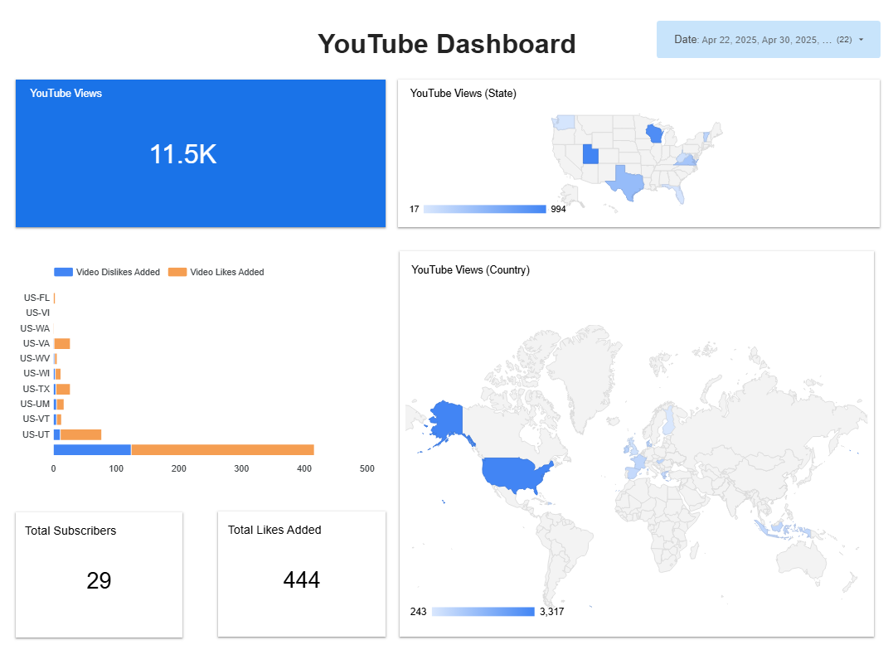

# Objective of the Dashboard
Dashboard ini bertujuan untuk memberikan gambaran menyeluruh mengenai performa channel YouTube dalam hal keterlibatan pengguna (engagement) dan pertumbuhan channel dalam periode waktu tertentu. Dashboard ini dirancang untuk membantu tim konten dan manajemen dalam:
- Memantau metrik utama performa channel
- Mengidentifikasi persebaran engagement channel
- Mengevaluasi efektivitas konten yang dipublikasikan

# Target Audience
- **Content Strategy Team**: Menilai konten yang paling engaging.
- **Marketing Team**: Memahami perilaku penonton berdasarkan lokasi & waktu.
- **YouTube Channel Manager / Creator**: Memantau pertumbuhan subscriber dan engagement harian.
- **Data Analyst**: Menganalisis pola interaksi dan distribusi regional.

# Expected Metrics & Dimensions
| Metrics (Numerik) | Dimensions (Kategori) |
| ------------- | ------------- |
| Views | Country Code, US State Code |
| Video Likes / Dislikes (Added/Removed) | US State Code | 
| User Subscription Added | |
| User Likes Added | |

# Dashboard

# Summary Findings
Pada bulan **April 2025**, channel YouTube menunjukkan performa yang cukup stabil dengan tren pertumbuhan positif. Sepanjang periode tersebut, channel berhasil menambah **29 subscriber baru**, mencerminkan adanya potensi pertumbuhan audiens lebih lanjut apabila didukung dengan strategi konten dan promosi yang tepat sasaran.

Dalam hal keterlibatan pengguna, total **jumlah penayangan (views)** yang tercatat mencapai **11.500**, menunjukkan adanya minat dan perhatian dari penonton terhadap konten yang dipublikasikan. Meskipun angka ini cukup signifikan, tingkat konversi penonton menjadi subscriber masih tergolong rendah, yang mengindikasikan perlunya peningkatan pada elemen seperti ajakan untuk berlangganan (call-to-action) atau kekuatan pembuka konten (hook) di awal video.

Dari sisi interaksi konten, jumlah **likes yang diberikan** pengguna mencapai **444**, sementara jumlah dislike sangat rendah dan tidak signifikan. Hal ini mengindikasikan bahwa sebagian besar audiens memberikan respon positif terhadap konten yang ditayangkan, dan kualitas konten sudah berada pada jalur yang tepat.

Secara geografis, distribusi penonton menunjukkan konsentrasi terbesar berasal dari beberapa negara bagian di Amerika Serikat, terutama **Utah (US-UT)** dan Wisconsin **(US-WI)**. Ini membuka peluang untuk mengembangkan strategi konten atau promosi yang lebih terarah di wilayah dengan performa tinggi tersebut.

- Link to dashboard: [Youtube Channel Report](https://lookerstudio.google.com/reporting/4023a101-da90-40d9-8f34-bc9258af65b5)
